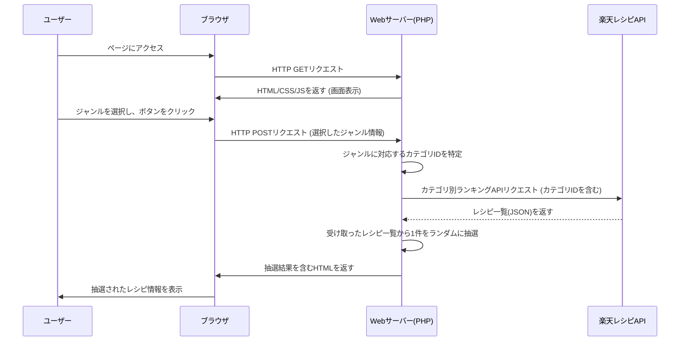

### 1. 要件定義

#### 1.1. システム概要
毎日の献立を考える手間を解消するため、利用者が指定した食事のジャンルに基づき、楽天レシピAPIからランダムに選ばれたレシピを一つ提案するWebアプリケーションを開発する。

#### 1.2. 用語定義
| 用語 | 説明 |
| --- | --- |
| MVP | Minimum Viable Product。顧客に価値を提供できる最小限の製品。 |
| 楽天レシピAPI | 楽天が提供する、レシピ情報（カテゴリ、ランキング等）を取得できるAPI。 |
| ジャンル | 和食、中華、イタリアンなどの料理のカテゴリ。 |

#### 1.3. 機能要件
| 機能ID | 機能名 | 概要 |
| :--- | :--- | :--- |
| F-001 | ジャンル選択機能 | ユーザーが食事のジャンル（例：和食、中華、イタリアン）をプルダウンメニューから選択できる。 |
| F-002 | レシピ提案機能 | 「今日の晩御飯を決める！」ボタンを押すと、選択されたジャンルに該当するレシピをランダムで1件表示する。 |
| F-003 | レシピ情報表示機能 | 提案されたレシピの「画像」「レシピ名」「楽天レシピへのリンク」を表示する。 |

#### 1.4. 非機能要件
| 項目 | 内容 |
| :--- | :--- |
| UI/UX | - 直感的に操作できるシンプルな画面構成とする。<br>- スマートフォンなどのモバイル端末でも見やすいレスポンシブデザインに対応する。 |
| 性能 | ユーザーがボタンを押してから3秒以内にレシピが表示されること。 |
| セキュリティ | ユーザーの個人情報は扱わないため、特別なセキュリティ要件は設けない。 |
---

### 2. 基本設計

#### 2.1. システム構成図
ユーザーのブラウザからのリクエストに対し、Webサーバー上のPHPが楽天レシピAPIと通信し、取得した情報をHTMLとして整形してブラウザに返す構成です。

```
[ユーザーのブラウザ]
      ↑↓ HTTPリクエスト/レスポンス
[Webサーバー]
  - PHP (バックエンド処理)
  - Bootstrap (フロントエンド)
      ↑↓ APIリクエスト/レスポンス (JSON)
[楽天レシピAPIサーバー]
```

#### 2.2. 機能一覧
要件定義の機能要件を、より具体化したものです。

| 機能ID | 機能名 | 処理概要 |
| :--- | :--- | :--- |
| F-001 | ジャンル選択機能 | - 事前に定義したジャンル（和食、中華、イタリアンなど）を画面のプルダウンに表示する。<br>- ユーザーが選択したジャンルの情報を保持する。 |
| F-002 | レシピ提案機能 | - ボタンが押されたら、選択されているジャンルに対応する楽天レシピのカテゴリIDを特定する。<br>- 楽天レシピカテゴリ別ランキングAPIにリクエストを送信し、レシピ一覧（ランキング）を取得する。[[1](https://www.google.com/url?sa=E&q=https%3A%2F%2Fvertexaisearch.cloud.google.com%2Fgrounding-api-redirect%2FAUZIYQEuaUOxt4hIF6xL2v7oydr69YblvLvJ8vbtRInKFmL-U6cW_Hv6XcxwUfDAo06zvozr5U0TTiOZcFsfFusRWoIx5C5pAS0EjZGvJXzOD43R7LampX0b7EpLG67dEQLAWpdHoJrGdptXo3TqWu9rUIb2Vt8%3D)][[2](https://www.google.com/url?sa=E&q=https%3A%2F%2Fvertexaisearch.cloud.google.com%2Fgrounding-api-redirect%2FAUZIYQFu7go0PqUynTICkyhP7Ytk6g9o8xMW4vcLTMqchf7oPAyxh3N6LHBUFAsathEAkO2r2c_qHcHvzcKH8LZMikbXLhrjyceGk_v8yyCiLwVh8PUsDe7DMhsdBiHQJXXitd0OCyzMqniPwmEcd4_ZnVllAQv6KD_sbpK0gDi0ST9rxQ%3D%3D)]<br>- 取得したレシピ一覧の中からランダムで1件を抽選する。 |
| F-003 | レシピ情報表示機能 | - 抽選されたレシピの情報を画面に表示する。<br>- 表示項目：レシピ画像、レシピタイトル、楽天レシピのURLへのリンク。 |

#### 2.3. 画面設計
**画面数:** 1画面（トップページ兼結果表示ページ）

**ワイヤーフレーム:**
```
+----------------------------------------------------+
|           今日の晩御飯ランダム提案アプリ           |
+----------------------------------------------------+
|                                                    |
|  食事のジャンルを選んでボタンを押してね！          |
|                                                    |
|  [ 和食 v]  <-- (プルダウンメニュー)               |
|                                                    |
|  [ 今日の晩御飯を決める！ ]  <-- (ボタン)          |
|                                                    |
+----------------------------------------------------+
|                                                    |
|  --- (レシピ決定後に表示されるエリア) ---          |
|                                                    |
|  +----------------------------------------------+  |
|  |                                              |  |
|  |             (レシピの画像)                   |  |
|  |                                              |  |
|  +----------------------------------------------+  |
|                                                    |
|  レシピ名: ○○ハンバーグ                         |
|                                                    |
|  [ このレシピを見る (楽天レシピへ) ] <-- (リンク) |
|                                                    |
+----------------------------------------------------+
```

#### 2.4. データベース設計
本アプリケーションは、ユーザー情報やレシピ情報を保存しないため、データベースは使用しません。

---

### 3. 詳細設計

#### 3.1. シーケンス図
ユーザー操作からレシピ表示までの一連の流れです。



#### 3.2. 内部設計（PHP）

**ファイル構成:**
```
/ (ルートディレクトリ)
|-- index.php      (メインの処理ファイル)
|-- config.php     (APIキーなどを記述)
|-- functions.php  (API通信などの関数を記述)
```

**主要な処理:**

1.  **`index.php`**
    *   画面のHTMLを描画する。
    *   POSTリクエストがある場合（ボタンが押された場合）
        *   `functions.php` の `getRecipe()` 関数を呼び出す。
        *   結果を受け取り、HTML内のレシピ表示エリアに埋め込む。

2.  **`config.php`**
    *   楽天APIのアプリケーションIDを定数として定義する。
    *   画面に表示するジャンルと、それに対応する楽天レシピのカテゴリIDの対応表（連想配列）を定義する。
        *   例: `['和食' => '10', '中華' => '13', 'イタリアン' => '15']`
        *   ※カテゴリIDは、楽天レシピカテゴリ一覧APIなどで事前に調べておく必要があります。
[[3](https://www.google.com/url?sa=E&q=https%3A%2F%2Fvertexaisearch.cloud.google.com%2Fgrounding-api-redirect%2FAUZIYQEqm4SghOMLbTLwMcZh3f4wxAQFvHCSHtxc3Egt4H-9SB5HlcB85HClxvi561sqFNa-QMNbKYcSFpbzrEsVig7FqAV8P1VNkP3N_LxA8LvwgkHL9cB8_Vp_Y8vRrEqQrYg6I-3AhMzYX87XOj6OGhQoOlJd9Cn7wMe9aJkHoQ%3D%3D)][[4](https://www.google.com/url?sa=E&q=https%3A%2F%2Fvertexaisearch.cloud.google.com%2Fgrounding-api-redirect%2FAUZIYQHA0kG6C1j9TtitS7FUQTnEv3MZf3XEJpFbdyDt0Rq6mTF8oNaDbrKwi7xkZyM3ZdGw_J-v1nCj2kwfKPknWwQHhIhk8G0AkKctuB-V8pBK2o4H-CjamXrCtZC8JIVFe8oxplgUsCoxD313d9FKXKW2im6bz3xtxhXa9ysH)]
3.  **`functions.php`**
    *   `getRecipe(string $categoryId)`: レシピを取得する関数
        *   引数で受け取ったカテゴリIDと、`config.php`のアプリケーションIDを使って、楽天レシピカテゴリ別ランキングAPIのエンドポイントURLを組み立てる。
[[2](https://www.google.com/url?sa=E&q=https%3A%2F%2Fvertexaisearch.cloud.google.com%2Fgrounding-api-redirect%2FAUZIYQFu7go0PqUynTICkyhP7Ytk6g9o8xMW4vcLTMqchf7oPAyxh3N6LHBUFAsathEAkO2r2c_qHcHvzcKH8LZMikbXLhrjyceGk_v8yyCiLwVh8PUsDe7DMhsdBiHQJXXitd0OCyzMqniPwmEcd4_ZnVllAQv6KD_sbpK0gDi0ST9rxQ%3D%3D)]        *   PHPの `file_get_contents` や `cURL` を使ってAPIにリクエストを送信する。
        *   返ってきたJSON文字列を `json_decode` でPHPの配列に変換する。
        *   取得したレシピの配列 (`result`) から、ランダムなインデックスを一つ選ぶ。
        *   選ばれたレシピの情報（`recipeTitle`, `foodImageUrl`, `recipeUrl`など）を連想配列として返す。
        *   API通信に失敗した場合は、エラー情報を返す。

#### 3.3. APIインターフェース設計

**利用API:** 楽天レシピカテゴリ別ランキングAPI
[[2](https://www.google.com/url?sa=E&q=https%3A%2F%2Fvertexaisearch.cloud.google.com%2Fgrounding-api-redirect%2FAUZIYQFu7go0PqUynTICkyhP7Ytk6g9o8xMW4vcLTMqchf7oPAyxh3N6LHBUFAsathEAkO2r2c_qHcHvzcKH8LZMikbXLhrjyceGk_v8yyCiLwVh8PUsDe7DMhsdBiHQJXXitd0OCyzMqniPwmEcd4_ZnVllAQv6KD_sbpK0gDi0ST9rxQ%3D%3D)]
*   **リクエストURL:**
    `https://app.rakuten.co.jp/services/api/Recipe/CategoryRanking/20170426`
*   **HTTPメソッド:** GET
*   **主要なリクエストパラメータ:**
    | パラメータ名 | 必須 | 説明 | 設定値の例 |
    | :--- | :--- | :--- | :--- |
    | `applicationId` | 必須 | 楽天ウェブサービスのアプリケーションID。 | `10...` (config.phpで管理) |
    | `categoryId` | 必須 | レシピを取得したいカテゴリのID。 | `10` (和食) |
*   **レスポンス（JSON）の利用部分:**
    *   `result[n].recipeTitle`: レシピのタイトル
    *   `result[n].foodImageUrl`: レシピの画像URL
    *   `result[n].recipeUrl`: 楽天レシピサイト上のレシピ詳細ページのURL

---
